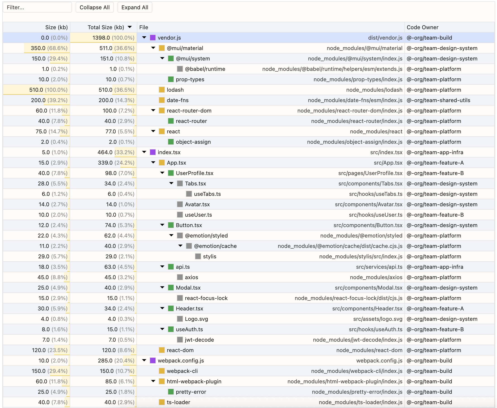

# tree-table

This is a small library for visualizing data in a tree table, inspired by the one in the Chrome DevTools performance tab. I couldn't find a library to visualize my own data in a similar format, so I created this.
This visualization tool is ideal for local development and not intended to be used in production.



## Examples

You can find more examples in the `examples` directory:

- [`cdn.html`](./examples/cdn.html): A basic example of using the library from a CDN.
- [`profile`](./examples/profile): An example of a complex performance profile visualization.
- [`dependencies`](./examples/dependencies): An example visualizing a dependency tree.
- [`stress`](./examples/stress): A stress test example with a large dataset.

## Usage

1.  **Include the script**

    Add the script to your HTML file.

    ```html
    <script src="https://cdn.jsdelivr.net/npm/treetable@1.0.1/dist/treetable.min.js"></script>
    ```

2.  **Create a container**

    Add a container element where the tree table will be rendered.

    ```html
    <div class="treetable-container" tabindex="0"></div>
    ```

3.  **Initialize**

    In your JavaScript, prepare your data and initialize the `TreeTable`.

    ```javascript
    const data = [
      {
        name: "Task",
        selfTime: 0.5,
        totalTime: 1234.5,
        source: "script.js:10",
        children: [
          // ... more nested data
        ],
      },
      // ... more data
    ];

    const options = {
      filter: true,
      columns: [
        {
          key: "selfTime",
          header: "Self (ms)",
          basis: "15%",
          type: "numeric",
          showPercentage: true,
        },
        {
          key: "totalTime",
          header: "Total (ms)",
          basis: "15%",
          type: "numeric",
          valueBar: true,
        },
        {
          key: "name",
          header: "Activity",
          basis: "70%",
          type: "text",
          isTreeColumn: true,
          secondaryKey: "source",
        },
      ],
    };

    const treeTable = new TreeTable(data, options);
    treeTable.render(".treetable-container");
    ```

## Options

### General Options

| Option      | Type      | Default | Description                                                        |
| ----------- | --------- | ------- | ------------------------------------------------------------------ |
| `filter`    | `boolean` | `false` | If `true`, a filter input is displayed to search through the tree. |
| `collapsed` | `boolean` | `true`  | If `false`, all tree nodes will be expanded by default.            |

### Column Options

The `columns` option is a mandatory array of objects, where each object configures a column in the table.

| Option           | Type      | Description                                                                                                     |
| ---------------- | --------- | --------------------------------------------------------------------------------------------------------------- |
| `key`            | `string`  | **Required.** The key in your data objects that corresponds to this column.                                     |
| `header`         | `string`  | **Required.** The text displayed in the column header.                                                          |
| `basis`          | `string`  | The CSS `flex-basis` for the column's width (e.g., '20%', '100px').                                             |
| `type`           | `string`  | Can be `'numeric'` or `'text'`. Numeric columns are right-aligned.                                              |
| `showPercentage` | `boolean` | For `'numeric'` columns. If `true`, displays the value as a percentage of the column's total.                   |
| `valueBar`       | `boolean` | For `'numeric'` columns. If `true`, shows a bar indicating the value relative to the max value in the column.   |
| `isTreeColumn`   | `boolean` | If `true`, this column will render the expandable/collapsible tree structure. Only one column should have this. |
| `secondaryKey`   | `string`  | For the tree column. A data key for a secondary piece of information to be displayed in the same cell.          |
